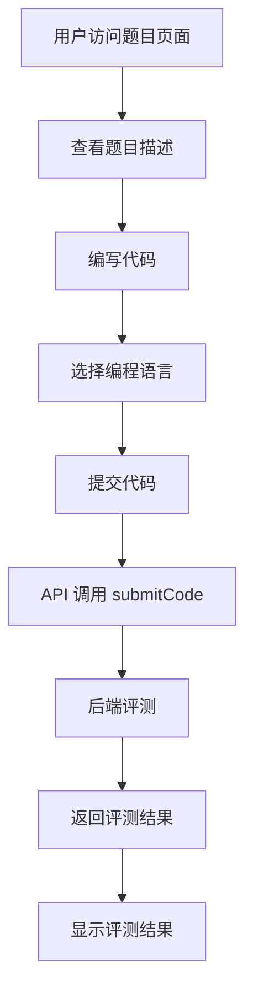
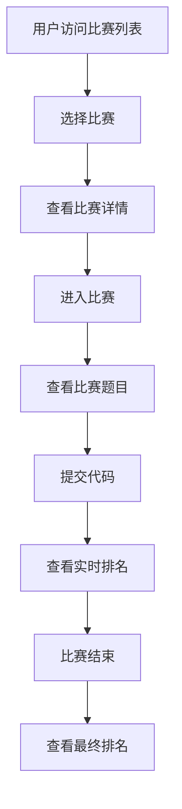
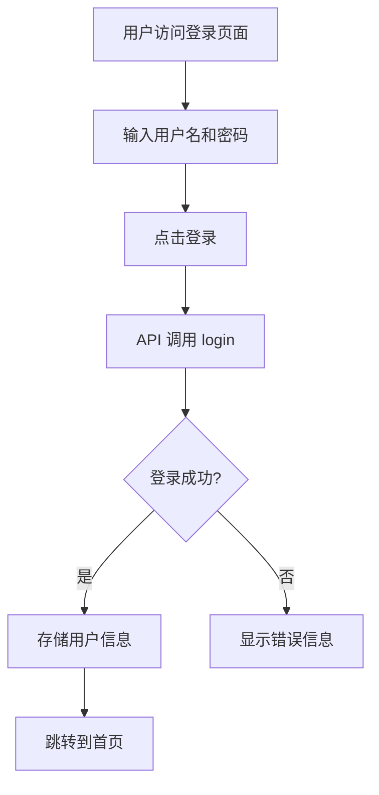

# OnlineJudgeFE 项目文档

## 1. 项目概述

OnlineJudgeFE 是一个基于 Vue.js 开发的在线判题系统前端项目，为用户提供题目浏览、提交代码、参加比赛、查看排名等功能，同时为管理员提供题目管理、比赛管理、用户管理等后台操作界面。

### 主要特点
- 基于 Webpack3 的多页面应用，优化了打包大小
- 集成了 Simditor 富文本编辑器和 CodeMirror 代码编辑器
- 使用 ECharts 实现数据可视化和图表展示
- 支持国际化（中文、英文、繁体中文）
- 响应式设计，支持现代浏览器和 IE 10+

### 技术栈
| 技术/框架 | 版本 | 用途 |
|---------|------|------|
| Vue | 2.5.13 | 前端框架 |
| Vuex | 3.0.1 | 状态管理 |
| Vue Router | 3.0.1 | 路由管理 |
| iView | 2.13.0 | UI 组件库 |
| Element UI | 2.3.7 | UI 组件库 |
| ECharts | 3.8.5 | 数据可视化 |
| Axios | 0.18.0 | HTTP 请求 |
| Moment | 2.22.1 | 时间处理 |
| KaTeX | 0.10.0 | 数学公式渲染 |
| Highlight.js | 9.12.0 | 代码高亮 |

## 2. 项目结构

项目采用多页面应用架构，主要分为普通用户（oj）和管理员（admin）两个页面入口。整体目录结构清晰，遵循 Vue 项目的最佳实践。

```
OnlineJudgeFE/
├── build/             # 构建配置文件
├── config/            # 项目配置文件
├── deploy/            # 部署相关文件
├── src/               # 源代码目录
│   ├── assets/        # 静态资源
│   ├── i18n/          # 国际化配置
│   ├── pages/         # 页面目录
│   │   ├── admin/     # 管理员页面
│   │   └── oj/        # 普通用户页面
│   ├── plugins/       # 插件
│   ├── store/         # Vuex 状态管理
│   ├── styles/        # 样式文件
│   └── utils/         # 工具函数
├── static/            # 静态文件
├── package.json       # 项目依赖和脚本
└── README.md          # 项目说明
```

### 核心目录说明

| 目录/文件 | 职责 |
|---------|------|
| src/pages/oj/ | 普通用户页面，包含题目、比赛、排名等功能 |
| src/pages/admin/ | 管理员页面，包含题目管理、比赛管理、用户管理等功能 |
| src/store/ | Vuex 状态管理，包含用户信息和比赛状态 |
| src/i18n/ | 国际化配置，支持中文、英文、繁体中文 |
| src/utils/ | 工具函数，包含常量定义、存储操作、时间处理等 |
| src/plugins/ | 插件，包含代码高亮、数学公式渲染等 |

## 3. 系统架构与主流程

### 架构图

```
┌─────────────────────────────────────────────────────────┐
│                     前端应用                            │
├─────────────────────────────────────────────────────────┤
│  ┌─────────────┐  ┌─────────────┐  ┌─────────────┐    │
│  │  普通用户页  │  │  管理员页   │  │  公共组件   │    │
│  └──────┬──────┘  └──────┬──────┘  └──────┬──────┘    │
│         │                │                │            │
│  ┌──────▼──────┐  ┌──────▼──────┐  ┌──────▼──────┐    │
│  │  Vue Router │  │  Vue Router │  │  全局插件   │    │
│  └──────┬──────┘  └──────┬──────┘  └─────────────┘    │
│         │                │                            │
│  ┌──────▼────────────────▼──────┐                     │
│  │         Vuex Store           │                     │
│  └──────────────┬───────────────┘                     │
│                 │                                     │
│  ┌──────────────▼───────────────┐                     │
│  │           API 调用           │                     │
│  └──────────────────────────────┘                     │
└─────────────────────────────────────────────────────────┘
```

### 主流程

1. **用户访问**：用户通过浏览器访问系统，根据 URL 路由到相应的页面
2. **身份验证**：系统检查用户是否登录，未登录用户访问需要权限的页面时会被重定向到登录页面
3. **数据加载**：页面加载时，通过 API 调用获取必要的数据，如题目列表、比赛信息等
4. **用户操作**：用户可以进行查看题目、提交代码、参加比赛等操作
5. **状态管理**：通过 Vuex 管理全局状态，如用户信息、比赛状态等
6. **响应更新**：当数据发生变化时，页面会相应更新，提供实时反馈

## 4. 核心功能模块

### 4.1 题目模块

**功能描述**：提供题目列表浏览、题目详情查看、代码提交等功能。

**核心组件**：
- `ProblemList.vue`：题目列表页面，支持题目筛选、搜索和分页
- `Problem.vue`：题目详情页面，显示题目描述、输入输出样例，提供代码编辑器

**关键功能**：
- 题目分类与筛选
- 题目搜索
- 代码编辑器（支持多种编程语言）
- 代码提交与评测状态查询

### 4.2 比赛模块

**功能描述**：提供比赛列表浏览、比赛详情查看、比赛排名等功能。

**核心组件**：
- `ContestList.vue`：比赛列表页面，显示即将开始、进行中和已结束的比赛
- `ContestDetails.vue`：比赛详情页面，包含比赛题目、提交、排名等信息
- `ContestRank.vue`：比赛排名页面，支持 ACM 和 OI 两种排名方式

**关键功能**：
- 比赛列表与详情
- 比赛题目查看与提交
- 实时排名更新
- 比赛倒计时

### 4.3 提交模块

**功能描述**：提供提交历史查看、提交详情查看等功能。

**核心组件**：
- `SubmissionList.vue`：提交列表页面，显示提交历史，支持筛选和搜索
- `SubmissionDetails.vue`：提交详情页面，显示代码、评测结果、运行时间等信息

**关键功能**：
- 提交历史查询
- 提交状态跟踪
- 评测结果详情查看
- 代码查看与复制

### 4.4 用户模块

**功能描述**：提供用户登录、注册、个人设置等功能。

**核心组件**：
- `Login.vue`：登录页面
- `Register.vue`：注册页面
- `Settings.vue`：个人设置页面，包含个人资料、账号设置、安全设置

**关键功能**：
- 用户登录与注册
- 个人资料管理
- 账号设置
- 密码修改

### 4.5 排名模块

**功能描述**：提供 ACM 排名和 OI 排名查看功能。

**核心组件**：
- `ACMRank.vue`：ACM 排名页面，显示用户的解题数量和时间
- `OIRank.vue`：OI 排名页面，显示用户的得分情况

**关键功能**：
- 实时排名更新
- 排名筛选与排序
- 用户排名详情

### 4.6 管理员模块

**功能描述**：提供题目管理、比赛管理、用户管理等后台操作功能。

**核心组件**：
- `ProblemList.vue`：题目管理页面，支持题目添加、编辑、删除
- `ContestList.vue`：比赛管理页面，支持比赛创建、编辑、删除
- `User.vue`：用户管理页面，支持用户信息查看和管理

**关键功能**：
- 题目管理（添加、编辑、删除、导入导出）
- 比赛管理（创建、编辑、删除、设置）
- 用户管理（查看、编辑、权限设置）
- 系统配置管理

## 5. 核心 API 与类

### 5.1 API 调用

项目使用 Axios 进行 HTTP 请求，主要 API 调用集中在 `api.js` 文件中。

**主要 API 函数**：

| 函数名 | 功能描述 | 参数 | 返回值 |
|-------|---------|------|--------|
| `getWebsiteConf` | 获取网站配置 | 无 | 网站配置信息 |
| `login` | 用户登录 | username, password | 登录结果 |
| `register` | 用户注册 | username, password, email | 注册结果 |
| `getProblemList` | 获取题目列表 | page, limit, filter | 题目列表 |
| `getProblem` | 获取题目详情 | problemID | 题目详情 |
| `submitCode` | 提交代码 | problemID, language, code | 提交结果 |
| `getSubmissionList` | 获取提交列表 | page, limit, filter | 提交列表 |
| `getSubmission` | 获取提交详情 | submissionID | 提交详情 |
| `getContestList` | 获取比赛列表 | page, limit, filter | 比赛列表 |
| `getContest` | 获取比赛详情 | contestID | 比赛详情 |
| `getContestRank` | 获取比赛排名 | contestID | 比赛排名 |

### 5.2 核心类与组件

**1. Vuex Store**

| 模块 | 功能描述 | 主要状态 | 主要 mutations |
|-----|---------|----------|----------------|
| `user` | 用户信息管理 | user, authed | LOGIN, LOGOUT, UPDATE_USER |
| `contest` | 比赛状态管理 | currentContest, contestRank | SET_CURRENT_CONTEST, UPDATE_CONTEST_RANK |
| `root` | 全局状态管理 | website, modalStatus | UPDATE_WEBSITE_CONF, CHANGE_MODAL_STATUS |

**2. 全局组件**

| 组件名 | 功能描述 | 主要属性 |
|-------|---------|----------|
| `Panel` | 面板组件 | title, collapsible |
| `VerticalMenu` | 垂直菜单组件 | items, activeIndex |
| `CodeMirror` | 代码编辑器组件 | value, language, readonly |
| `Highlight` | 代码高亮组件 | code, language |
| `Pagination` | 分页组件 | total, pageSize, current |

**3. 工具类**

| 工具类 | 功能描述 | 主要方法 |
|-------|---------|----------|
| `storage` | 本地存储操作 | get, set, remove, clear |
| `filters` | 过滤器 | formatTime, formatMemory, formatLanguage |
| `time` | 时间处理 | formatDuration, formatDate |
| `utils` | 通用工具 | debounce, throttle, deepClone |

## 6. 技术实现细节

### 6.1 多页面应用配置

项目使用 Webpack 配置为多页面应用，主要配置在 `build/webpack.base.conf.js` 文件中。通过 `glob` 模块自动识别页面入口，每个页面都有独立的入口文件和 HTML 模板。

### 6.2 国际化实现

项目使用 `vue-i18n` 实现国际化，支持中文、英文、繁体中文三种语言。国际化配置文件存放在 `src/i18n` 目录中，分为管理员页面和普通用户页面两个部分。

### 6.3 状态管理

项目使用 Vuex 进行状态管理，主要分为 `user` 和 `contest` 两个模块，分别管理用户信息和比赛状态。全局状态包括网站配置和模态框状态。

### 6.4 路由配置

项目使用 Vue Router 进行路由管理，主要分为普通用户路由和管理员路由。路由配置中包含权限控制，未登录用户访问需要权限的页面时会被重定向到登录页面。

### 6.5 代码编辑器

项目使用 `vue-codemirror-lite` 实现代码编辑器，支持多种编程语言的语法高亮和代码提示。

### 6.6 数据可视化

项目使用 ECharts 实现数据可视化，主要用于排名页面的图表展示。

## 7. 项目运行与部署

### 7.1 开发环境

**前置条件**：
- Node.js v8.12.0+
- npm 3.0.0+

**安装依赖**：
```bash
npm install
```

**构建 DLL**：
```bash
# Linux
export NODE_ENV=development 
npm run build:dll

# Windows
set NODE_ENV=development 
npm run build:dll
```

**启动开发服务器**：
```bash
# 设置后端代理
export TARGET=http://Your-backend

# 启动开发服务器
npm run dev
```

### 7.2 生产环境

**构建生产版本**：
```bash
npm run build
```

**部署**：
项目提供了 Docker 部署配置，位于 `deploy` 目录中。可以使用 Docker 容器化部署，也可以直接部署到静态文件服务器。

## 8. 目录结构详解

### 8.1 普通用户页面 (`src/pages/oj/`)

```
oj/
├── components/        # 组件
├── router/           # 路由配置
├── views/            # 页面视图
│   ├── contest/      # 比赛相关页面
│   ├── general/      # 通用页面
│   ├── help/         # 帮助页面
│   ├── problem/      # 题目相关页面
│   ├── rank/         # 排名页面
│   ├── setting/      # 设置页面
│   ├── submission/   # 提交相关页面
│   └── user/         # 用户相关页面
├── App.vue           # 应用根组件
├── api.js            # API 调用
├── index.html        # HTML 模板
└── index.js          # 入口文件
```

### 8.2 管理员页面 (`src/pages/admin/`)

```
admin/
├── components/        # 组件
├── views/             # 页面视图
│   ├── contest/       # 比赛管理
│   ├── general/       # 通用管理
│   └── problem/       # 题目管理
├── App.vue            # 应用根组件
├── api.js             # API 调用
├── index.html         # HTML 模板
├── index.js           # 入口文件
└── router.js          # 路由配置
```

### 8.3 状态管理 (`src/store/`)

```
store/
├── modules/           # 模块
│   ├── contest.js     # 比赛状态
│   └── user.js        # 用户状态
├── index.js           # 根 store
└── types.js           #  mutation 类型
```

### 8.4 国际化 (`src/i18n/`)

```
i18n/
├── admin/            # 管理员页面国际化
│   ├── en-US.js      # 英文
│   ├── zh-CN.js      # 中文
│   └── zh-TW.js      # 繁体中文
├── oj/               # 普通用户页面国际化
│   ├── en-US.js      # 英文
│   ├── zh-CN.js      # 中文
│   └── zh-TW.js      # 繁体中文
└── index.js          # 国际化配置
```

## 9. 核心功能流程图

### 9.1 代码提交流程



### 9.2 比赛参与流程



### 9.3 用户登录流程



## 10. 关键模块与典型用例

### 10.1 题目提交

**功能说明**：用户可以在题目详情页面提交代码，系统会对代码进行评测并返回结果。

**使用步骤**：
1. 访问题目详情页面
2. 在代码编辑器中编写代码
3. 选择编程语言
4. 点击提交按钮
5. 查看评测结果

**常见问题**：
- 编译错误：检查代码语法是否正确
- 运行时错误：检查代码逻辑是否正确
- 超时：检查算法复杂度是否过高
- 内存超限：检查内存使用是否合理

### 10.2 比赛参与

**功能说明**：用户可以参加正在进行的比赛，提交代码并查看实时排名。

**使用步骤**：
1. 访问比赛列表页面
2. 选择正在进行的比赛
3. 进入比赛详情页面
4. 查看比赛题目
5. 提交代码
6. 查看实时排名

**注意事项**：
- 比赛期间，提交的代码会实时评测
- 比赛结束后，排名会最终确定
- 不同比赛可能有不同的规则（ACM 或 OI）

### 10.3 个人设置

**功能说明**：用户可以修改个人资料、账号信息和安全设置。

**使用步骤**：
1. 登录系统
2. 进入个人设置页面
3. 修改个人资料
4. 修改账号信息
5. 修改密码

**注意事项**：
- 修改密码需要验证旧密码
- 邮箱修改需要验证新邮箱
- 头像上传支持图片裁剪

## 11. 配置、部署与开发

### 11.1 配置文件

项目的主要配置文件位于 `config` 目录中：
- `index.js`：主要配置文件，包含开发环境和生产环境的配置
- `dev.env.js`：开发环境变量
- `prod.env.js`：生产环境变量

### 11.2 部署方式

**Docker 部署**：
1. 构建 Docker 镜像：`docker build -t onlinejudge-fe .`
2. 运行容器：`docker run -d -p 80:80 onlinejudge-fe`

**Nginx 部署**：
1. 构建生产版本：`npm run build`
2. 将 `dist` 目录部署到 Nginx 服务器
3. 配置 Nginx 反向代理到后端 API

### 11.3 开发规范

- 代码风格：使用 ESLint 进行代码检查
- 命名规范：组件名使用 PascalCase，变量名使用 camelCase
- 目录结构：按照功能模块组织代码
- 注释规范：关键代码需要添加注释

## 12. 监控与维护

### 12.1 错误监控

项目集成了 Sentry 错误监控，配置文件位于 `src/utils/sentry.js`。当发生错误时，错误信息会被发送到 Sentry 服务器，便于开发人员及时发现和修复问题。

### 12.2 性能优化

- 使用 Webpack DLL 插件减少构建时间
- 按需加载组件，减少初始加载时间
- 图片懒加载
- 代码分割

### 12.3 常见问题与解决方案

| 问题 | 解决方案 |
|-----|---------|
| 页面加载缓慢 | 检查网络连接，清除浏览器缓存 |
| 提交代码失败 | 检查网络连接，确保代码符合要求 |
| 登录失败 | 检查用户名和密码是否正确，尝试重置密码 |
| 比赛排名不更新 | 刷新页面，确保网络连接正常 |
| 代码编辑器无响应 | 清除浏览器缓存，刷新页面 |

## 13. 总结与亮点回顾

OnlineJudgeFE 是一个功能完整、界面美观的在线判题系统前端项目，具有以下亮点：

1. **架构清晰**：采用 Vue 生态系统的最佳实践，代码结构清晰，易于维护和扩展。

2. **用户体验**：界面美观，操作流畅，响应式设计，支持多种设备。

3. **功能完善**：涵盖了在线判题系统的所有核心功能，包括题目管理、比赛管理、提交评测、排名系统等。

4. **技术先进**：使用最新的前端技术栈，如 Vue 2.5、Vuex 3.0、ECharts 等。

5. **国际化支持**：支持中文、英文、繁体中文三种语言，满足不同用户的需求。

6. **性能优化**：采用多种性能优化手段，如代码分割、按需加载、Webpack DLL 等，提高页面加载速度和运行效率。

7. **部署便捷**：提供了 Docker 部署配置，便于快速部署和维护。

OnlineJudgeFE 不仅是一个功能完整的在线判题系统前端，也是学习 Vue 生态系统和前端工程化的优秀范例。通过本项目，可以了解如何构建一个大型 Vue 应用，如何进行状态管理、路由配置、国际化实现等前端开发中的常见问题。

## 14. 附录

### 14.1 常用命令

| 命令 | 描述 |
|-----|------|
| `npm install` | 安装依赖 |
| `npm run build:dll` | 构建 DLL |
| `npm run dev` | 启动开发服务器 |
| `npm run build` | 构建生产版本 |
| `npm run lint` | 代码检查 |

### 14.2 技术文档

- [Vue 官方文档](https://vuejs.org/v2/guide/)
- [Vuex 官方文档](https://vuex.vuejs.org/)
- [Vue Router 官方文档](https://router.vuejs.org/)
- [ECharts 官方文档](https://echarts.apache.org/zh/index.html)
- [iView 官方文档](https://www.iviewui.com/docs/guide/introduce)
- [Element UI 官方文档](https://element.eleme.io/#/zh-CN)

### 14.3 项目地址

- [GitHub 仓库](https://github.com/shaohuihuang/OnlineJudgeFE)
- [Demo 地址](https://qduoj.com)

### 14.4 许可证

项目使用 MIT 许可证，详情请查看 [LICENSE](LICENSE) 文件。

## 15. 与 OnlineJudge 后端的关系

### 15.1 OnlineJudge 项目概述

OnlineJudge 是一个完整的在线判题系统，由多个模块组成：

- **后端(Django)**：[https://github.com/shaohuihuang/OnlineJudge](https://github.com/shaohuihuang/OnlineJudge)
- **前端(Vue)**：[https://github.com/shaohuihuang/OnlineJudgeFE](https://github.com/shaohuihuang/OnlineJudgeFE)
- **判题沙箱(Seccomp)**：[https://github.com/shaohuihuang/Judger](https://github.com/shaohuihuang/Judger)
- **判题服务器**：[https://github.com/shaohuihuang/JudgeServer](https://github.com/shaohuihuang/JudgeServer)

### 15.2 OnlineJudge 后端架构

OnlineJudge 后端是基于 Django 和 Django Rest Framework 开发的 API 服务，主要包含以下模块：

| 模块 | 职责 |
|-----|------|
| `account` | 用户账户管理，包括注册、登录、个人资料等 |
| `announcement` | 公告管理，发布系统公告 |
| `conf` | 系统配置，包括网站设置、评测服务器管理 |
| `contest` | 比赛管理，支持 ACM/OI 两种比赛模式 |
| `judge` | 判题相关，处理代码评测逻辑 |
| `problem` | 题目管理，包括题目创建、编辑、测试用例管理 |
| `submission` | 提交管理，处理用户代码提交和评测结果 |
| `utils` | 工具函数，提供通用功能支持 |

### 15.3 前后端交互关系

OnlineJudgeFE 作为前端项目，通过 API 调用与 OnlineJudge 后端进行交互：

1. **API 调用**：前端通过 Axios 发送 HTTP 请求到后端 API 端点
2. **数据传输**：后端返回 JSON 格式的数据，前端解析并展示
3. **认证机制**：使用 JWT 或 Session 进行用户认证
4. **实时更新**：对于比赛排名等需要实时更新的功能，前端通过定时轮询获取最新数据

### 15.4 核心 API 接口

| API 端点 | 功能描述 | 前端调用 |
|---------|---------|----------|
| `/api/auth/login/` | 用户登录 | `login` 函数 |
| `/api/auth/register/` | 用户注册 | `register` 函数 |
| `/api/problems/` | 获取题目列表 | `getProblemList` 函数 |
| `/api/problems/{id}/` | 获取题目详情 | `getProblem` 函数 |
| `/api/submissions/` | 提交代码 | `submitCode` 函数 |
| `/api/submissions/{id}/` | 获取提交详情 | `getSubmission` 函数 |
| `/api/contests/` | 获取比赛列表 | `getContestList` 函数 |
| `/api/contests/{id}/` | 获取比赛详情 | `getContest` 函数 |
| `/api/contests/{id}/rank/` | 获取比赛排名 | `getContestRank` 函数 |

### 15.5 部署关系

两个项目的部署关系如下：

1. **后端部署**：OnlineJudge 后端部署为 Django 应用，提供 API 服务
2. **前端部署**：OnlineJudgeFE 构建后部署为静态文件，通过 Nginx 或其他 Web 服务器提供访问
3. **反向代理**：通过 Nginx 配置反向代理，将前端的 API 请求转发到后端服务
4. **判题服务**：JudgeServer 和 Judger 部署为独立服务，与后端通过网络通信

### 15.6 技术栈对比

| 类别 | OnlineJudge (后端) | OnlineJudgeFE (前端) |
|-----|-------------------|---------------------|
| 语言 | Python 3.8.0+ | JavaScript |
| 框架 | Django 3.2.9, Django Rest Framework 3.12.0 | Vue 2.5.13, Vuex 3.0.1, Vue Router 3.0.1 |
| 数据库 | MySQL | - |
| 缓存 | Redis | - |
| UI 组件 | - | iView 2.13.0, Element UI 2.3.7 |
| 数据可视化 | - | ECharts 3.8.5 |
| 构建工具 | - | Webpack 3.6.0 |

### 15.7 项目协作流程

1. **后端开发**：实现 API 接口和业务逻辑
2. **前端开发**：根据 API 文档实现用户界面和交互
3. **联调测试**：前后端联调，确保 API 调用正常
4. **部署上线**：同时部署后端和前端服务

通过这种前后端分离的架构，使得项目具有更好的可维护性和扩展性，同时也便于团队协作开发。